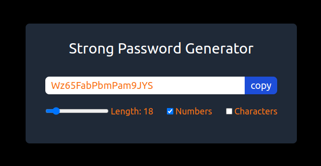

# Random Password Generator

This React.js application provides a user-friendly interface for generating secure and customizable random passwords.

## Features:

- Generate passwords of any desired length (within reasonable limits)
- Choose to include letters, numbers, and symbols for increased complexity
- Easily copy the generated password to your clipboard with a single click

#### [Live Demo](https://strong-random-password-generator.vercel.app/) on Vercel

  

## Usage

1. Open the application in your web browser.
2. Use the slider to adjust the desired password length.
3. Select the character sets you want to include in the password (numbers, symbols).
4. A new random password will be displayed.
5. Click the "Copy" button to copy the password to your clipboard.
